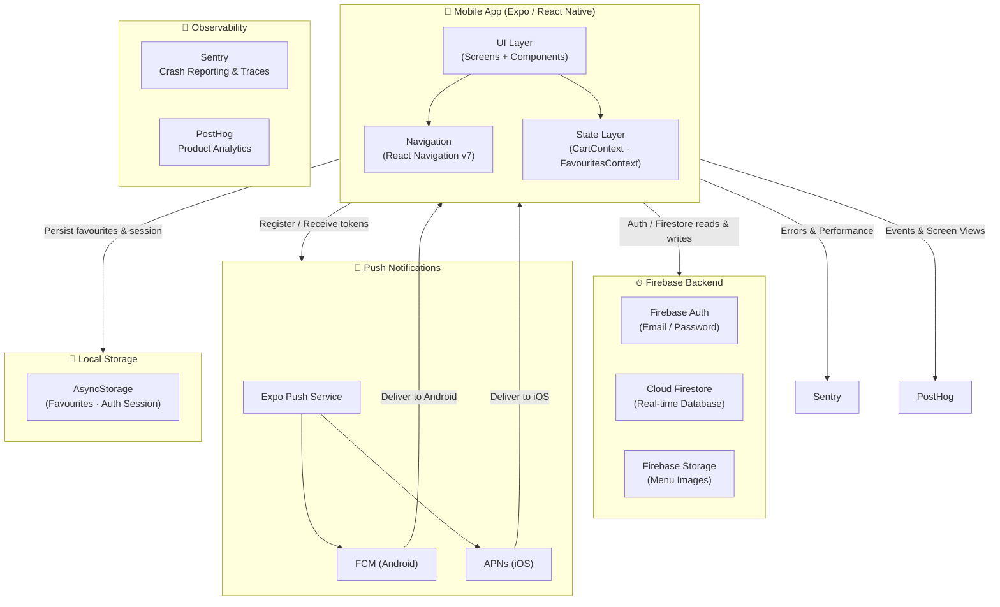
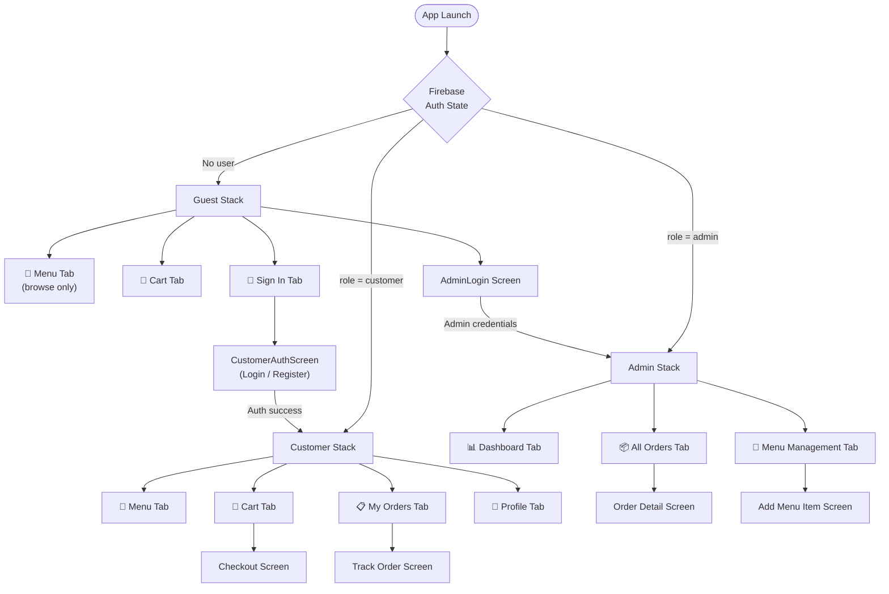
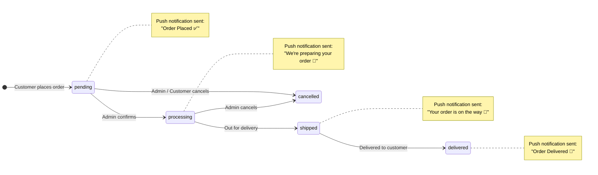
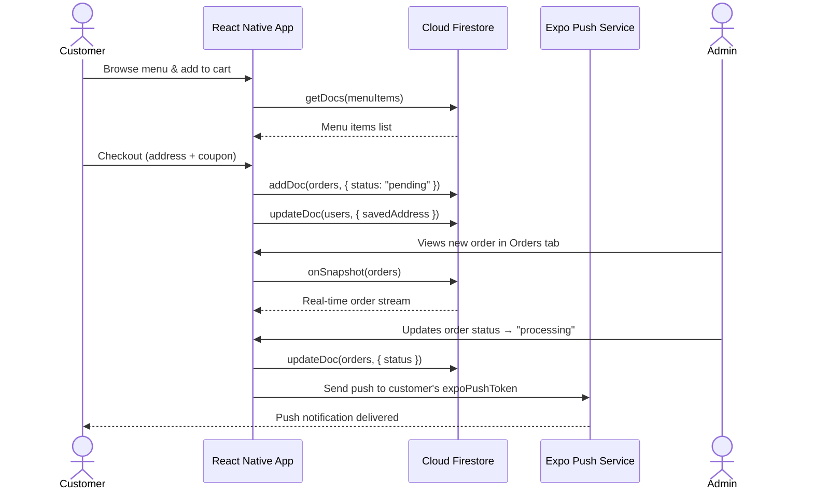
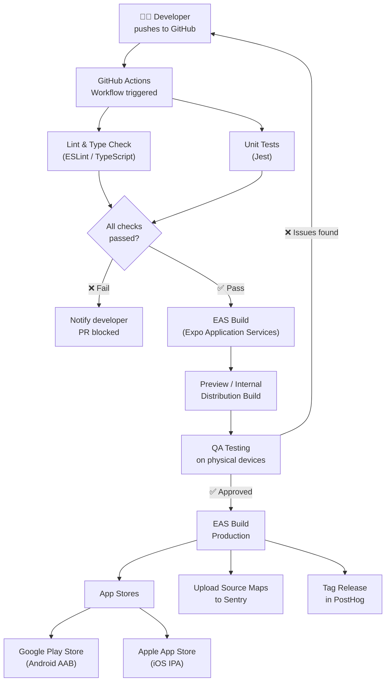
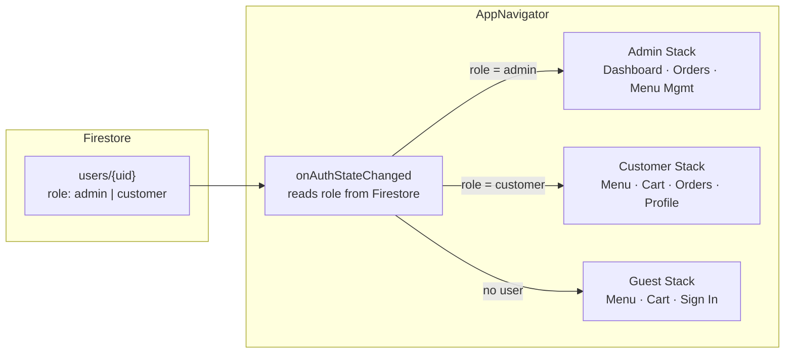
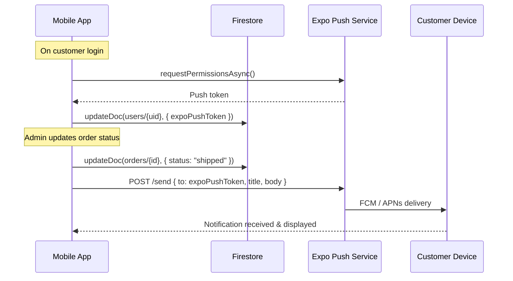

<div align="center">

# 🌿 Balcony Aroma

### A production-grade food ordering app built with React Native & Expo

[](https://reactnative.dev/)
[](https://expo.dev/)
[](https://firebase.google.com/)
[](https://sentry.io/)
[](https://posthog.com/)
[](./LICENSE)

A full-featured, dual-role food ordering platform with real-time Firestore sync, push notifications, error monitoring via **Sentry**, and product analytics via **PostHog**.

</div>

---

## Table of Contents

- [Overview](#overview)
- [System Architecture](#system-architecture)
- [Navigation Flow](#navigation-flow)
- [Order Lifecycle](#order-lifecycle)
- [Data Flow](#data-flow)
- [Features](#features)
- [Tech Stack](#tech-stack)
- [Project Structure](#project-structure)
- [Getting Started](#getting-started)
- [Firebase Setup](#firebase-setup)
- [Sentry — Error Tracking](#sentry--error-tracking)
- [PostHog — Analytics](#posthog--analytics)
- [CI/CD Pipeline](#cicd-pipeline)
- [Role-Based Access Control](#role-based-access-control)
- [Coupon System](#coupon-system)
- [Push Notifications](#push-notifications)
- [Contributing](#contributing)

---

## Overview

**Balcony Aroma** is a restaurant-grade mobile ordering app that supports two distinct user roles — **Admin** and **Customer** — each with their own navigation stack and permission set. Orders are stored in Firestore in real time, push notifications keep customers updated at every order stage, and the app is fully instrumented with **Sentry** for crash reporting and **PostHog** for behavioural analytics.

---

## System Architecture



---

## Navigation Flow



---

## Order Lifecycle



---

## Data Flow



---

## Features

### Customer
| Feature | Details |
|---|---|
| Menu Browsing | Real-time menu with emoji, name, price, category |
| Cart Management | Add / remove items, special requests per item, quantity badge |
| Reorder | One-tap reorder from order history |
| Favourites | Locally persisted with AsyncStorage |
| Checkout | Delivery address, coupon codes, delivery fee logic, order notes |
| Cash on Delivery | Single payment method clearly indicated |
| Order Tracking | Live status updates with colour-coded stages |
| Order History | Full history with timestamps and order numbers |
| Profile | Name, phone, saved delivery address, profile image via ImagePicker |
| Push Notifications | Status updates at every order stage |

### Admin
| Feature | Details |
|---|---|
| Dashboard | Overview of order stats |
| Order Management | Real-time feed of all orders, filterable by status |
| Order Detail | Full order view, status update controls |
| Menu Management | View, add, edit, and delete menu items with images |
| Manual Orders | Place orders on behalf of customers |
| Push Triggers | Automatic push sent to customer on every status change |

---

## Tech Stack

| Category | Technology | Version |
|---|---|---|
| Framework | Expo | ~54.0.0 |
| Language | React / React Native | 19.1.0 / 0.81.5 |
| Navigation | React Navigation (Stack + Bottom Tabs) | ^7.x |
| Backend | Firebase (Auth + Firestore) | ^12.15.0 |
| Push Notifications | expo-notifications | ~0.32.17 |
| Media | expo-image-picker, expo-av | ~17.x / ~16.x |
| Error Tracking | Sentry | — |
| Analytics | PostHog | — |
| Local Persistence | AsyncStorage | 2.2.0 |
| State Management | React Context API | built-in |

---

## Project Structure

```
balcony-aroma/
├── App.js                          # Root — auth listener, notification bootstrap
├── app.json                        # Expo config (icons, orientation, plugins)
├── firebase.js                     # Firebase app, Firestore, Auth initialization
├── index.js                        # Expo entry point
├── assets/
│   ├── icon.png
│   ├── android-icon-foreground.png
│   ├── android-icon-background.png
│   ├── android-icon-monochrome.png
│   └── favicon.png
└── src/
    ├── theme.js                    # Colors, status color/label maps
    ├── navigation/
    │   └── AppNavigator.js         # Role-based stack (Guest / Customer / Admin)
    ├── context/
    │   ├── CartContext.js          # Cart state: add, remove, reorder, special requests
    │   └── FavouritesContext.js    # Favourites persisted to AsyncStorage
    ├── components/
    │   ├── HomeScreen.js
    │   └── OrderCard.js            # Shared order card component
    └── screens/
        ├── admin/
        │   ├── LoginScreen.js      # Admin email/password login
        │   ├── DashboardScreen.js  # Stats overview
        │   ├── OrdersScreen.js     # Real-time order list
        │   ├── OrderDetailScreen.js # Status management + push trigger
        │   ├── MenuManagementScreen.js
        │   ├── AddMenuItemScreen.js
        │   └── AddOrderScreen.js   # Manual order placement
        └── customer/
            ├── CustomerAuthScreen.js # Register / login
            ├── MenuScreen.js         # Browse + favourites
            ├── CartScreen.js         # Cart review + quantity controls
            ├── CheckoutScreen.js     # Address, coupon, billing, place order
            ├── OrderHistoryScreen.js # Past orders + reorder
            ├── TrackOrderScreen.js   # Live status tracker
            └── ProfileScreen.js      # Profile + image picker
```

---

## Getting Started

### Prerequisites

- [Node.js](https://nodejs.org/) >= 18
- [Expo CLI](https://docs.expo.dev/get-started/installation/): `npm install -g expo-cli`
- [Expo Go](https://expo.dev/client) on your physical device, or an Android/iOS simulator

### Install

```bash
git clone https://github.com/ankit79600/Balcony-aroma-app.git
cd Balcony-aroma-app
npm install
```

### Run

```bash
npm start          # Open Expo dev tools
npm run android    # Launch on Android
npm run ios        # Launch on iOS
npm run web        # Launch in browser
```

---

## Firebase Setup

### Services Used

| Service | Purpose |
|---|---|
| Firebase Auth | Email/password authentication for admin and customer |
| Cloud Firestore | Real-time NoSQL database for all app data |

### Firestore Schema

#### `users/{uid}`
```json
{
  "name": "Ankit Patel",
  "phone": "+91 98765 43210",
  "email": "user@example.com",
  "role": "customer",
  "savedAddress": "123 Main St, Apartment 4B",
  "profileImage": "https://...",
  "expoPushToken": "ExponentPushToken[...]"
}
```

#### `menuItems/{itemId}`
```json
{
  "name": "Paneer Tikka",
  "price": 180,
  "emoji": "🍢",
  "category": "Starters",
  "imageUrl": "https://...",
  "available": true
}
```

#### `orders/{orderId}`
```json
{
  "orderNumber": "BA-0042",
  "customerUid": "uid_abc123",
  "customerName": "Ankit Patel",
  "customerPhone": "+91 98765 43210",
  "customerAddress": "123 Main St",
  "items": [
    { "id": "item_1", "name": "Paneer Tikka", "price": 180, "qty": 2, "emoji": "🍢", "specialRequest": "Extra spicy" }
  ],
  "totalAmount": 390,
  "deliveryFee": 0,
  "discount": 0,
  "couponCode": "WELCOME10",
  "notes": "Ring the doorbell twice",
  "status": "pending",
  "createdAt": "<Timestamp>",
  "updatedAt": "<Timestamp>"
}
```

### Order Status Colors

| Status | Label | Color |
|---|---|---|
| `pending` | Order Placed | `#F39C12` |
| `processing` | Preparing | `#3498DB` |
| `shipped` | Out for Delivery | `#9B59B6` |
| `delivered` | Delivered | `#27AE60` |
| `cancelled` | Cancelled | `#E74C3C` |

---

## Sentry — Error Tracking

[Sentry](https://sentry.io/) provides real-time error monitoring across all platforms:

- **Automatic crash reports** on iOS and Android with full stack traces
- **Performance monitoring** — traces for key user flows (checkout, order placement)
- **Source maps** — minified JS mapped back to readable source for easier debugging
- **Breadcrumbs** — action trail leading up to any crash
- **Release tracking** — link errors to specific app versions

> Configure your Sentry DSN in your environment before building for production.

---

## PostHog — Analytics

[PostHog](https://posthog.com/) is integrated for product and behavioural analytics:

- **Screen tracking** — knows which screens users visit and for how long
- **Event capture** — key funnel events: `item_added_to_cart`, `checkout_started`, `order_placed`, `coupon_applied`
- **Funnel analysis** — identify where customers drop off between Menu → Cart → Checkout → Confirmation
- **Feature flags** (optional) — ship features to a subset of users for A/B testing
- **Session recording** (optional) — replay user sessions to identify UX friction

---

## CI/CD Pipeline



### Branch Strategy

| Branch | Purpose | Auto Build |
|---|---|---|
| `main` | Production-ready code | Production EAS build |
| `develop` | Active development | Preview build |
| `feature/*` | Feature branches | Lint + test only |
| `hotfix/*` | Urgent production fixes | Production EAS build |

---

## Role-Based Access Control



| Feature | Guest | Customer | Admin |
|---|---|---|---|
| Browse Menu | ✅ | ✅ | ✅ |
| Add to Cart | ✅ | ✅ | — |
| Place Orders | — | ✅ | ✅ (manual) |
| Order History | — | ✅ (own) | ✅ (all) |
| Track Orders | ✅ (by ID) | ✅ | — |
| Update Order Status | — | — | ✅ |
| Manage Menu Items | — | — | ✅ |
| View Dashboard | — | — | ✅ |
| Profile Management | — | ✅ | — |
| Favourites | — | ✅ | — |

---

## Coupon System

The app supports four built-in coupon codes at checkout:

| Code | Type | Value |
|---|---|---|
| `WELCOME10` | Percentage | 10% off order total |
| `SAVE20` | Flat discount | ₹20 off order total |
| `BALCONY15` | Percentage | 15% off order total |
| `FREE` | Delivery waiver | Free delivery |

**Delivery fee:** ₹30 flat, automatically waived on orders ≥ ₹200.  
**Payment method:** Cash on Delivery.  
**Order number format:** `BA-0001`, `BA-0002`, … (auto-incremented from Firestore).

---

## Push Notifications



**Android:** Uses a dedicated `orders` notification channel with `MAX` importance and default sound.  
**iOS:** Standard APNs delivery via Expo infrastructure.

---

## Contributing

1. Fork the repo
2. Create a feature branch: `git checkout -b feature/your-feature`
3. Commit your changes: `git commit -m "feat: add your feature"`
4. Push to the branch: `git push origin feature/your-feature`
5. Open a Pull Request against `main`

---

## License

This project is licensed under the [MIT License](./LICENSE).

---

<div align="center">

Built by **Ankit Patel** · [@ankit79600](https://github.com/ankit79600)

</div>
